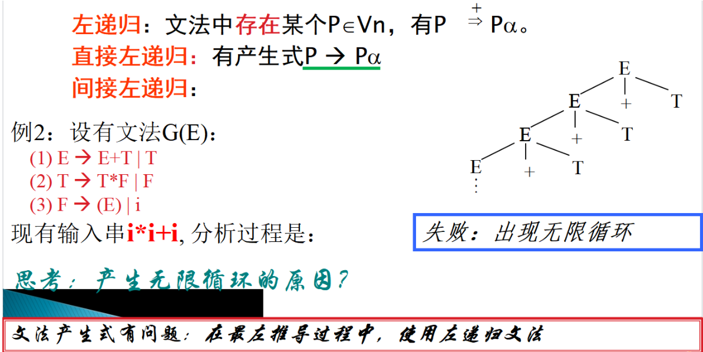

#### 

**语法（syn-tax）;组合单词以形成词组、从句或句子的方法。**

# 1.上下文无关文法

上下文无关文法是描述语言的语法结构的形式规则。
是一种工具，它可用于严格定义句子的结构。
用有穷的规则刻划无穷的集合。

用来精确而无歧义地描述语言的语法单位的构成方式。
文法在描述语言的时候不考虑它的含义。

## 1.1文法定义

在词法分析识别出正确的单词符号串的基础上，分析并判定这些单词符号串是否能构成正确的表达式、语句或程序。

**语法规则如何定义和表示？**

高级语言的语法结构适合用**上下文无关文法**来描述。

**如何判断是否符合规则?**

语法分析方法。

### 常用的语法分析方法（根据建立语法树的方向）：

**自上而下分析法：**从文法的开始符号出发，自上而下建立语法树。一般是使用最左推导 ，尽可能使用各种产生式，推导出与输入串匹配的句子。
**自下而上分析法：**从输入符号串开始，自下而上建立语法树。逐层向上，直至得到文法的开始符号。

| 自上而下分析 | 自下而上分析 |
| ------------ | ------------ |
| 预测分析(LL) | LR分析       |
| 递归下降分析 | 算符优先分析 |
|              |              |

**由四部分组成：**
**非终结符号：**规则中用尖括号括起来的符号，表示一些语法成分，可以推导出其他的语法成分,表示一定符号串的集合，是一个类，如<主语>、<谓语>
**终结符号：**是组成该语言的最基本的符号，是不可再分的基本符号,如你、我、大学生等
**开始符号：**规则中的一个特殊的非终结符号，语言中的句子都从它开始推导,如<句子>，<程序>
**产生式：**定义语法成分的规则

### **约定：**

用大写字母表示非终结符，小写字母表示终结符，用小写希腊字母(如α、β)表示任意符号串
如果S是文法G的开始符号，可以将文法G写成G[S]
如果没有标明，第一条产生式的左部符号为开始符号

## 1.2推导

**推导**: 连续使用产生式右部去替换符号串中的左部非终结符的过程,得到的连续序列称为一个推导。

如果存在v=w0=>w1=>w2...=>Wn=w(n>0)，则称
    v推导出w（长度为n），记作v=>w(至少一步)
若有v=>w或v=w，则记作v=>w(0步或若干步)

**直接推导：**又称一步推导(用 符号=>表示),就是用某条规则的右部去替换该规则的左部符号的过程

如果α→β是文法 G=(Vn,Vt,P,S)的产生式，γ和δ是Ｖ*中的任意符号串
则有  γαδ => γβδ 或  v => w若：v=γαδ, w=γβδ
称为：v直接产生w ，w是v的直接推导

**例：S01, 0S0=>0010(直接推导γ＝０,δ＝０)**

**推导过程**提供了一种证明给定的符号串是否符合文法规则的方法

**推导中的问题**

**推导的每一步都有两个选择：**

1. 替换哪个非终结符
2. 用该非终结符的哪个候选式进行替换

**在推导之前确定推导的顺序，是对句子进行确定性分析所必须的**

**最左推导:** 在整个推导过程中,任何一步推导α=>β都是对α中最左边的非终结符进行替换。
 **最右推导:**

## 1.3归约

**归约:**推导的逆过程。
**直接归约：**直接推导的逆过程

## 1.4文法产生的语言

文法G所产生的语言定义为：
     L(G)={x|S=>x,其中S为文法的开始符号，x∈Vt*} 。
**即: 是文法可以推导出的所有句子构成的集合**

**文法等价**

若文法G1和文法G2所产生的语言相同，即L(G1) = L(G2)，则称文法G1和文法G2等价。

## 1.5语法树

- 用推导的方式来表示一个文法产生某个符号串的过程，但是推导不能表示符号串的各个组成部分间的结构关系
- 推导过程可以用树来表示，观察句子的构成，表示句子的层次关系

- 语法树：推导的形式化表示，有助于理解句子语法结构的层次
- 每个结点都有一个标记，该标记属字母集中的一个符号，根由开始符号Ｓ标记。
- 当某个非终结符用它的某个候选式替换时，就产生相应的下一层的结点，候选式中自左至右的每个符号对应一个新的结点，并标记它，画出其与父结点之间的连线。

## 1.6二义文法

并不是任何情况下一个句型就唯一地对应一棵语法树。

定义：如果一个文法存在某个句型对应两棵不同的语法树，则说这个文法是二义的 。

ie，不同的语法树对应不同的最左推导过程 

## 1.7消除二义性

对二义文法中的某些句型的分析过程是不唯一的，因此总是希望文法是无二义的。

文法的二义性并不代表语言一定是二义的。**只有当产生一个语言的所有文法都是二义的，这个语言才是二义的**。
**改写文法：**重新构造一个等价的无二义性文法
**补充规则：**不改变文法的原有规则，**加进一些非形式规定**

（1）可以利用算符之间的**优先级和结合性**改写文法来消除算术表达式文法的二义性。

（2）**强制规定：**如悬空else，规定else总是和最近的尚未匹配的if匹配。一般不修改文法的产生式，而是在分析过程中直接进行判断 

# 2.自上而下语法分析

**基本思路是**：对给定的输入符号串，从文法的开始符号出发，为每个非终结符寻求可能的候选式进行匹配，试图自上而下地为输入符号串建立一棵语法树，**使其端末节点正好与输入符号串相同**
从推导的角度看，从开始符号出发，**使用最左推导，试图推导出与输入符号串相同的句子**
**这是一个反复试探的过程**

## 一、自上而下语法分析中的问题探究

### **问题1：分析器不稳定（回溯）**

###  问题2：无限循环（左递归）

**总结：**

1. **左递归和回溯问题的产生直接与描述语言的文法有关**

2. **应该改造文法，使其不含左递归和回溯，才能进行确定的自上而下分析**

   

### 问题的解决方法

## 

#### 1.消除左递归

##### 直接左递归消除

**利用文法等价**

##### 间接左递归的消除

#### 2.**消除回溯**

**利用文法等价**

**例子**

## 二、LL(1)文法 

### 1.first集

**文法满足怎样的条件才不会产生回溯？**

由某候选式推出的所有符号串中的第一个终结符构成的集合。

**再来分析前面产生回溯的文法可知，若某个非终结符有多个候选式，若其首终结符集相交，就会产生回溯**

####  结论：

**只要存在某个非终结符的两个候选式的首终结符集相交，就会在推导的某时刻产生回溯。从而导致语法分析器选择了错误的侯选式**

**因此，不产生回溯的条件就是：**
对非终结符A的任意两个不同的侯选式ai 和aj ，都有：
		First(ai)∩ First(aj) = φ

当要求用A进行匹配时，就能根据当前所面临的输入符号，准确地选取一个A的侯选式。

#### 求候选式的First集的算法 

### 2.follow集

**是否满足：没有左递归，每个侯选式的首终结符集不相交这两个条件，就一定能进行确定的自上而下的分析呢？**

非终结符的后随符号集

**当非终结符A面临输入符号a时， a不属于A的任何一个侯选式的首终结符集，如果A的某个候选的首终结符集中含ε，只有当a∈FOLLOW(A)时才能使用ε自动进行匹配。**

#### 求非终结符A的Follow集的算法

### 3.分析过程

### 4.LL(1) 文法的定义

### 5.LL(1)文法的判别 

### 6.LL(1)文法的分析过程（总结）

## 三、递归下降分析方法

**递归分析程序的优点**

## 四、预测分析方法

